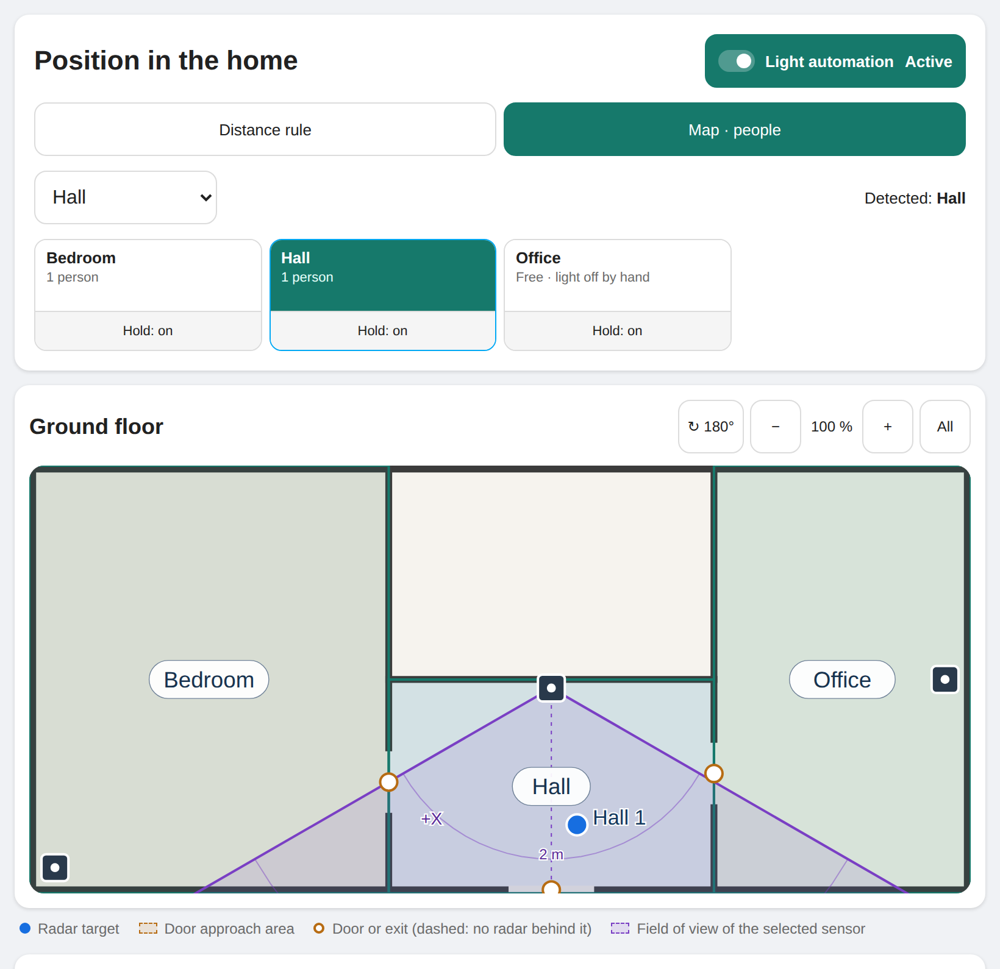

# Radar Occupancy

Room occupancy for Home Assistant from mmWave radar sensors (HLK-LD2450 and
similar) that **does not switch the light off on people who sit still**.

[Deutsch weiter unten](#deutsch)



## Quick start

1. Install through HACS (below) and restart Home Assistant.
2. *Settings → Devices & services → Add integration → Radar Occupancy →
   Room*. Choose the radar device of the room; its sensors are suggested.
   Pick the light of the room.
3. Walk out through the door once, then press **Learn door from last exit**
   on the room's device page. Done: the room now stays occupied while you sit
   still and frees when you leave.
4. Optional, for counting people with several persons at home: add *Home*
   and a *Floor plan* (or use a robot vacuum map) and calibrate the sensors
   on the position card, see [Map mode](#map-mode-optional-people-counted-through-doors).

## The problem

Radar presence sensors lose people who sit or lie still. An automation that
clears the room when presence drops therefore turns the light off at the desk,
on the sofa or in bed, and back on at the next movement. Longer timeouts only
move the problem.

## The idea

A room is a latch. Radar presence sets it; only **evidence of leaving** clears
it:

| Evidence | Meaning |
| --- | --- |
| **Left through the door** | The target disappeared within the configured *door range*, the distance from the sensor at which people walk out. |
| **Handed over** | Another room took the person over (optional, single-person households). |
| **Safety timeout** | Nobody was seen for a configurable time (or never, if set to 0). |
| **Released** | Pressed the *Release* button, or switched *Hold occupancy* off. |

If the target disappears anywhere else, for example at the desk 1 m from the
sensor, the room stays occupied.

**Sub-areas** cover parts of a room seen by the same sensor, such as a balcony
behind the room. Disappearing there is never leaving, even inside the door
range, and a sub-area can switch its own light.

## Installation

HACS → ⋮ → *Custom repositories* → `https://github.com/ChristophBellmann/ha-radar-occupancy`,
category *Integration*. Install *Radar Occupancy* and restart Home Assistant.

Manually: copy `custom_components/radar_occupancy` into your `config/custom_components`.

## Public integration and local configuration

This repository is the reusable integration and its position card. Install it
through HACS or copy `custom_components/radar_occupancy` into your Home Assistant
configuration directory. No particular home, sensor naming scheme or private
configuration repository is required.

Your installation keeps its own configuration: Home Assistant config entries
store room, radar, light and map assignments; `config/.storage/radar_occupancy`
stores calibration and integration runtime data. Uploaded floor plans and other
local assets also stay in your Home Assistant configuration. These files are
not part of this public repository and must be preserved when updating.

Updates replace only `config/custom_components/radar_occupancy`. Restart Home
Assistant after updating, wait until it has fully started, then check the room
entities, position card, calibration and light control. Existing installations
keep their configured rooms; installation alone does not create room entries.
When migrating from another radar automation, transfer light control room by
room so that one controller owns each light.

For development, change and test the code here first, commit and push it, then
install that commit or release in the local Home Assistant installation. Any
host-specific update script belongs in that installation's configuration repo.

## Setup

*Settings → Devices & services → Add integration → Radar Occupancy → Room*.
Choose the **radar device**: its sensors are suggested in the next step
(entities named like *target 1 x*, *Ziel 1 Entfernung* etc.), and the room
name defaults to the device's area. Check the suggestions:

- **Presence**: the radar's presence binary sensor.
- **Distance of target 1** (recommended): needed for the door range, e.g. the
  target 1 distance sensor of ESPHome's `ld2450` component.
- **X / Y of target 1** (optional): needed for sub-areas.
- **Light** (optional).

Then open the room's *Configure* dialog for door range, safety timeout,
handover, brightness, run-on time and time window.

### Calibrating the door range

1. Walk into the room and out through the door at normal speed.
2. Press **Learn door from last exit** on the room's device page.

The door range then starts 50 cm before the point where the radar lost you.
*Last seen distance* shows the value; you can also set the range by hand.
A door range of 0 to 0 (default) means every disappearance counts as leaving,
i.e. plain presence behaviour.

### Handover (single-person households)

Rooms that take part in handover release each other: if a room lost its target
near the door at least 20 s ago and another taking-part room sees someone, the
first room is free. *Hand over even when lost away from the door* helps where
two rooms connect at a spot the sensor cannot tell from the inside. *Take over
only from this distance* ignores fixed echoes close to a sensor, such as a door
leaf.

With visitors, a room can be released while someone is still in it. Leave
handover off unless one person lives in the home, or switch
`switch.<home>_handover_between_rooms` off while guests are here (needs the
*Home* entry).

## Light control

With a light configured:

- **Entering** switches the light on (brightness, *Only when dark* via
  `sun.sun`, time window): the room's count rises, or in map mode someone
  comes in through a door while the room is still held. Moving around inside
  the room switches nothing. If it gets dark (or the time window opens)
  while someone is in the room, the light comes on when they are next seen.
  A switch-on the lamp did not confirm is repeated up to three times.
  *Last brightness set by hand* fades to the brightness you chose last
  instead of the fixed one.
- **Leaving**: after the run-on time the light is switched off — also a light
  that was on before someone entered, because whoever entered owns it.
  A light switched on while nobody entered stays on.
- **Switched off** in an occupied room (switch, app, voice command or another
  automation, also right after the light came on for entering): the light
  stays off, also after leaving briefly (to the
  bathroom at night and back) and while someone in bed turns over. Switching
  it on again gives it back to the automation; with a home entry it also ends
  after the room was empty for 30 minutes (configurable), when someone
  comes in through a door after nobody was seen there for that time, and at
  once in the room someone enters the home through (stairs, front door): the
  lights you switched off when leaving come on again when you return.
  Arrivals are only people walking away from the door into the room; somebody
  the radar loses and finds again at the door on the way out is none.
- Rooms sharing a light keep it on while any of them is occupied.
- With a home entry, lights **fade** in and out in perceptually even steps
  (CIE L*), at most one command per lamp in flight, so slow cloud lamps get
  no backlog. Software steps run at up to 20 Hz; native transitions interpolate
  perceptual waypoints at up to 5 Hz, starting dim when the lamp was off. Fading out never
  switches on a lamp of a group that is already off.
- Lamps that are unreachable drop commands silently. The light is switched off
  up to three times and checked again every five minutes, also after a restart,
  until it really reports off.

## Map mode (optional): people counted through doors

*People in the home at most* (`number.<home>_people_in_the_home_at_most`,
default 2, 0 = no limit) bounds the counts. Every departure the sensors miss
leaves a held place behind; above the limit the held place nobody is visible
in goes first: the room someone just vanished from, otherwise the one
confirmed longest ago. Raise it while visitors are here.

Add *Home* once (*Add integration → Radar Occupancy → Home*). It brings

| Entity | |
| --- | --- |
| `switch.<home>_light_automation` | Master switch for all lights |
| `switch.<home>_map_mode` | Off: every room uses its distance rule |
| `switch.<home>_handover_between_rooms` | Off while guests are here: no handover in the distance rule |
| `number.<home>_fade_in`, `number.<home>_fade_out` | Fade times, 0 = switch |
| `sensor.<home>_overview` | People in the home; attributes feed the position card |

Map mode places every radar target on a map of the floor, fuses the targets of
all sensors and counts **people per room**. A room becomes free only when
everybody evidently walked out through a door. Somebody seen in another room
says nothing about this room, so it works with several people.

### The map: robot vacuum or floor plan

| Map source | Room outlines | Doors |
| --- | --- | --- |
| Saved map of a robot vacuum ([dreame_vacuum](https://github.com/Tasshack/dreame-vacuum) camera) | from the map | found where map rooms touch |
| **Floor plan image** (*Add integration → Radar Occupancy → Floor plan*) | drawn on the card | marked on the card |

A floor plan is any PNG or JPEG of one floor in the `www` folder of your
configuration, e.g. `floorplans/ground.png`, plus the real width of the whole
image in metres (measure one wall and scale it up). Add one entry per floor.

Per room (*Configure*): *Map* (robot camera or floor plan), *Room on the map*
(robot maps: the segment), *Doors to these map rooms* (robot maps: only real
doors; empty = every adjacent segment), and X/Y of targets 2 and 3. Map rooms
without a radar count as outside.

### Calibration on the position card

The **position card** (`type: custom:radar-occupancy-card`) is loaded
automatically; add it to any dashboard. Its texts follow your Home Assistant
language (English or German). For every sensor:

Set `floor_order` on the card to keep floors in a chosen order, for example
`floor_order: [camera.upper_map, camera.lower_map]`. Use the map-source IDs;
other available floors follow afterwards. The order stays stable after restarts.

1. **Place sensor** at its mounting point, then **Orient sensor**: turn the
   field of view until your dot appears where you stand. Ceiling sensors
   instead take three or more **calibration points**.
2. Floor plans: **Draw room outline**, then **Mark door** for every door
   (choose the room behind it, tap the door) and **Mark exit** for stairs or
   the front door. Robot maps bring outlines and doors; correct them if needed.

Distorted calibrations are detected; such rooms keep their distance rule.
Walking towards a door pre-lights the room behind it (dim). Where no sensor
sees behind a door, someone the radar loses at that door while walking towards
it gets the room ahead lit at full brightness at once; occupancy only moves with
evidence, so a person who stayed at the door keeps their room, and the light
fades out like a pre-light if nobody turns up.

Services: `sample`, `undo_sample`, `sample_area`, `set_location`,
`set_orientation`, `set_boundary`, `reset_calibration`, `set_calibration`
(backup/import), `set_exit`, `set_door`, `set_floor`, `refresh_maps`,
`release`.

## Entities per room

| Entity | |
| --- | --- |
| `binary_sensor.<room>` | Occupancy; attributes `reason`, `mode` (`map`/`distance`), `people` (map mode), `last_distance`, `last_x`, `last_y`, `light_owned`, `light_mode` |
| `sensor.<room>_last_seen_distance` | Where the radar last saw a target |
| `switch.<room>_hold_occupancy` | Off: the room follows live presence only |
| `switch.<room>_automatic_light`, `switch.<room>_only_when_dark` | If a light is configured |
| `button.<room>_release` | Clear a held occupancy (refused while a target is present) |
| `button.<room>_learn_door_from_last_exit` | See calibration |

`reason` is a stable code for automations. Distance rule: `present`, `held`,
`in_area`, `left_through_door`, `handed_over`, `safety_timeout`, `released`,
`live`, `unavailable`, `empty`. Map mode: `moved`, `came_in`, `went_out`,
`seen_in_room`, `appeared_at_door`, `released`, `hold_off`, with the rooms in
`reason_from` and `reason_to` (`outside` for outside the home). A sensor that
goes offline keeps the last decision.

## Troubleshooting

- **Room stays occupied**: press the room tile on the card for a second, or
  `button.<room>_release`. Check `reason` on the occupancy sensor.
- **Map not available**: robot maps need a saved map in the vacuum app; floor
  plans need a PNG/JPEG below `www`. Use *Reload maps* on the card.
- **Bug reports**: download the diagnostics of the home and the room entry
  (*Settings → Devices & services → Radar Occupancy → ⋮ at the entry →
  Download diagnostics*) and attach them to an issue. They contain entity ids,
  settings and calibration, no images.

## Background

The logic comes from a home with seven LD2450 sensors and was tuned against
recorded history. In an office with the desk 0.2 to 1.3 m from the sensor and
the door at 5.4 m, real exits disappeared at 4.7 to 7.6 m, and losses at the
desk at 0.15 to 2.3 m. A plain "presence off for 15 s" rule switched off 33
times in that period, nine of them on someone sitting at the desk; the door
range rule, replayed against the same history, switched off 24 times, none of
them at the desk, and missed no exit.

## Roadmap

- Map sources of other robot vacuum integrations.
- More card languages (texts live in one table in the card).

## Compatibility

Tested with Home Assistant 2026.2 and 2026.9. Any radar works that provides a presence
binary sensor and, for the door range, a distance sensor in millimetres.

## Development

```bash
pip install -r requirements_test.txt
pytest
```

`engine.py` holds the occupancy logic without Home Assistant imports.

## License

Apache-2.0

---

## Deutsch

Raumbelegung aus mmWave-Radarsensoren (z. B. HLK-LD2450), die **das Licht
nicht ausschaltet, wenn jemand still sitzt**.

Ein Raum wird durch Radar-Anwesenheit belegt und nur durch einen Nachweis
wieder frei: Das Ziel verschwand im **Türbereich**, ein anderer Raum hat die
Person **übernommen** (nur Einpersonenhaushalt), die **Sicherheitsabschaltung**
griff, oder jemand hat **freigegeben**. Verschwindet das Ziel woanders, etwa am
Schreibtisch, bleibt der Raum belegt. **Teilbereiche** (z. B. ein Balkon, den
der Raumsensor mit sieht) zählen nie als Verlassen und können ein eigenes
Licht schalten.

**Einrichten:** Raum hinzufügen und das Radar-Gerät wählen; Anwesenheit,
Entfernung und X/Y werden vorgeschlagen, der Name kommt aus dem Bereich des
Geräts. Bei Besuch den Schalter **Übergabe zwischen Räumen** der Wohnung
ausschalten.

**Türbereich einmessen:** normal durch die Tür hinausgehen, danach
**Türbereich vom letzten Verlassen lernen** drücken. Der Bereich beginnt dann
50 cm vor der Stelle, an der das Radar dich verloren hat.

**Kartenmodus** (optional, Eintrag „Wohnung“): Radarziele auf einer Karte,
Personen je Raum über Türen gezählt, mehrpersonentauglich. Als Karte dient die
gespeicherte Karte eines Saugroboters (dreame_vacuum) oder ein **Grundriss**
als Bild (Eintrag „Grundriss“: PNG/JPEG im Ordner `www` plus die echte Breite
des Bildes in Metern). Auf einem Grundriss werden Raumgrenzen gezeichnet und
Türen markiert. Licht: von Hand ausgeschaltet bleibt aus (auch nach kurzem
Verlassen), weiches Ein- und Ausblenden, Vorblenden bei Annäherung.
Eingemessen wird in der Positionskarte `custom:radar-occupancy-card`.

Einrichtung, Entitäten und Positionskarte sind auf Deutsch und Englisch.


### Öffentliche Integration, lokale Einrichtung

Dieses öffentliche Repo enthält die wiederverwendbare Integration und die
Positionskarte. Sensoren, Räume, Lichter und Karten werden je Installation in
Home Assistant eingerichtet. Ein privates Konfigurationsrepo ist dafür nicht
notwendig. Konfigurationseinträge sowie Kalibrierung und Laufzeitdaten unter
`config/.storage/` bleiben lokal und bei Updates erhalten.

Nach der Installation Home Assistant vollständig starten lassen, Räume über
„Integration hinzufügen“ anlegen und die Positionskarte einbinden. Nach Updates
bestehende Raumbelegung, Kalibrierung, Freigabe und Lichtsteuerung prüfen. Beim
Umstieg vorhandene Lichtautomatik je Raum ablösen, damit nur eine Steuerung das
Licht schaltet. Ein lokales Update-Skript gehört zum jeweiligen privaten
Konfigurationsrepo; es übernimmt nur den Code aus diesem öffentlichen Repo.

## Simulation / Simulation eines Rundgangs

The position card's **Simulate room** button starts a visible animated person
in the selected room. **Simulation** lets you draw paths for several people.
The original instant dry-run action `simulate` still returns intended commands. It requires a calibrated room and loaded map. The default starts
with virtual lights off and no occupants; actual sensors, lights and held
occupancy stay unchanged. The card bypasses darkness/time limits in this test.

**Raum simulieren** startet eine sichtbare Animation. Standardmäßig ist sie
eine Vorschau; für echte Lampen siehe unten. Die ursprüngliche Aktion
`simulate` bleibt eine sofortige virtuelle Auswertung. Für einen eigenen
sofortigen Test nutze **Entwicklerwerkzeuge → Aktionen**:

```yaml
action: radar_occupancy.simulate
data:
  ignore_restrictions: true
  held: false
  route:
    - room: binary_sensor.example_room_occupancy
      x: 2000
      y: 3000
      seconds: 4
    - seconds: 5  # No observation: radar loses someone sitting still.
    - room: binary_sensor.example_room_occupancy
      x: 3000
      y: 2000
      seconds: 2
response_variable: walk_report
```

Replace entity IDs and coordinates with your own. Coordinates are **map
millimetres**, before display rotation, not radar millimetres or screen pixels.
Room entry IDs or occupancy entity IDs are accepted. Add closely spaced
waypoints towards a door and into the next room to test a handover; losing a
target in the middle of a room deliberately keeps it occupied. Sub-areas are
recognized using the configured parent sensor transform and radar boundaries.
The response contains `timeline`, `commands` and `unavailable_lights`.

`held: true` starts with one virtual held person per mapped room. Darkness and
time windows apply unless `ignore_restrictions: true`. Auto-light settings are
respected; the sandbox enables its own master switch. The action is bounded
at 30 waypoints, each 0.5–120 seconds; it runs virtual time immediately.
It tests decisions and reports fade intentions, not radio coverage, physical
lamp acknowledgement, real fade timing or cloud/network delays. No private
map data is shipped in this public repository.


### Animated people and real light test / Animierte Personen und Lichttest

On the position card, open **Simulation**. **Generate paths automatically**
is enabled by default: choose **People** (1–8) and **Duration**, then start.
Each person gets different starting positions, destinations, speeds and pauses.
Paths follow known doors and calibrated outlines, including concave rooms.
Disconnected floor maps receive separate walkers; no stair connection is invented.
The selected room is the first person's preferred start. For manual paths,
disable automatic generation, select a person and **Draw path on map**, then tap
waypoints along the rooms and doors. Add people to give each
one an independent route and color. **Wait 10 s** repeats the last position;
**Lose target · 60 s** creates a radar dropout. Up to eight people run at once.
Positions interpolate between waypoints at walking speed. All people start
together; a shorter route stays at its final position until the longest route
ends. Use dropout after approaching an exit to test leaving; dropout in a room
keeps a sitting person counted when hold is enabled. Paths do not avoid walls
automatically: place waypoints along the actual doors and corridor. Observations
closer than the tracker's resolution may merge, just like real radar targets.

**Echte Lichter steuern** einschalten und **Simulation starten** drücken:
Die farbigen Personen bewegen sich auf der Karte und steuern die zugeordneten
Lampen einschließlich Helligkeit, Ein-/Ausblenden und Nachlauf. Die normale
Radar-Lichtsteuerung pausiert während dieses Tests. Die echten Radarwerte und
Raumbelegungen laufen weiter; Simulationsbelegungen werden separat angezeigt
und nicht gespeichert. Der Hauptschalter der Lichtautomatik muss an sein;
sein Ausschalten stoppt den Lichttest. Der Kartenknopf testet unabhängig von
Dunkelheit und Zeitfenstern, berücksichtigt aber deaktivierte Raumautomatik.

**Stoppen**, das Ende des längsten Wegs, das Entladen der Integration oder ein
reguläres Herunterfahren beenden die Sitzung und stellen die zuvor aktiven
Lichtzustände und Helligkeiten wieder her. Manuelle Lichtänderungen während
des Tests werden bei der Wiederherstellung berücksichtigt. Geräte, die nicht
erreichbar sind, werden in der Ansicht gemeldet. Ohne **Echte Lichter steuern**
bleibt es eine Vorschau mit farbigen Markern und simulierten Belegungen.

```yaml
action: radar_occupancy.start_simulation
data:
  live_lights: true
  ignore_restrictions: true
  persons:
    - id: Person 1
      route:
        - room: binary_sensor.example_room_occupancy
          x: 2000
          y: 3000
          seconds: 5
        - room: binary_sensor.example_hall_occupancy
          x: 5000
          y: 1000
          seconds: 8
        - seconds: 60
    - id: Person 2
      route:
        - room: binary_sensor.example_room_occupancy
          x: 3500
          y: 3000
          seconds: 60
```

Stop with `radar_occupancy.stop_simulation`. Coordinates are local map mm;
use your own geometry. `seconds` is time spent reaching a waypoint from the
previous point; the first waypoint is a stationary starting position. A repeated
position creates a pause. Each person is bounded to 30 waypoints, each taking
0.5–120 seconds. Floor changes use the configured exits and doors; there is no
interpolation between separate floor maps. These animation actions run in real
time; the instant `simulate` action runs compressed virtual time.


### Automatische unabhängige Rundgänge

**Simulation → Wege automatisch erstellen** ist voreingestellt. Nur
**Personen** und **Dauer** wählen und **Simulation starten** drücken.
Jede Person bekommt einen unabhängigen Weg mit eigenen Zielen, Gehgeschwindigkeit
und Pausen. Der Knopf **Rundgang simulieren** startet mit diesen Einstellungen.
Die Wege führen durch die bekannten Türen, auch um Ecken in verwinkelten Räumen.
Unverbundene Räume bzw. Stockwerkskarten erhalten getrennte Startpositionen;
fehlende Türverbindungen werden nicht durch Wege durch Wände ersetzt.
**Echte Lichter steuern** bleibt als Option für den realen Lichttest verfügbar.

```yaml
action: radar_occupancy.start_simulation
data:
  automatic: true
  count: 3
  duration: 180
  live_lights: true
  ignore_restrictions: true
```

Optional: `room` für den Start der ersten Person und `seed` für wiederholbare
Wege bei gleicher Konfiguration. Automatische Wege werden für 30–900 Sekunden
erzeugt und können mehr Wegpunkte als handgezeichnete Wege haben. Die farbigen
Wege erscheinen direkt auf der Karte. Eigene Wege bleiben über das Abschalten
der automatischen Erstellung verfügbar. **Stoppen** beendet den Test und
stellt bei aktivem Lichttest die vorherigen Lampenzustände wieder her.


### Realistic radars and light delay / Realistische Radare und Lichtverzögerung

Simulated radars behave like the real ones: each sensor reports only people in
its field of view (7 m, ±60°) in its own room and on the threshold of its doors,
and only every `sensor_interval` seconds (default 1 s, ESPHome's LD2450 rate);
in between the last coordinates stay. With `see_through_doors` (default) a
sensor also sees further along a line of sight through an open doorway;
switched off, the simulation gives the cautious bound for closed or angled
doors. Corners no sensor sees, such as the area in front of a bathroom door,
stay blind in the simulation as well. `sensor_interval: 0` with
`field_of_view: false` gives the ideal sensor of earlier versions.

`measure_simulation` runs the same walks at once on a virtual clock and returns
`latency`: for every time a person really entered a room with a light, when the
light was decided, in seconds after entering (negative: before). `prelit` is
the dim pre-light on approach, `lit` the switch-on for entering; device latency
and the fade come on top.

Simulierte Radare melden nur, was im eigenen Sichtfeld und Raum liegt, und nur
alle `sensor_interval` Sekunden. `measure_simulation` misst damit, wie viele
Sekunden nach dem Betreten eines Raums das Licht beschlossen wird.

```yaml
action: radar_occupancy.measure_simulation
data:
  automatic: true
  count: 1
  duration: 300
  seed: 7
  ignore_restrictions: true
response_variable: result  # result.latency
```


### Detected people and held occupancy / Erkannte Personen und gehaltene Belegung

Room tiles show confirmed, simultaneously visible people. **Held occupancy**
is shown separately: a radar dropout cannot establish how many people remain
in the room. The overview sensor counts only currently detected people.
Lights still respect held occupancy. Repeated target appearances without a
confirmed door passage do not add people. Version 0.3.5 cleans up earlier
inflated stored counts once, retaining occupancy for each affected room.

Raumkacheln zeigen bestätigte, gleichzeitig sichtbare Personen. **Belegung
gehalten** steht separat: Nach einem Radaraussetzer ist nicht bekannt, wie
viele Personen noch im Raum sind. Der Lagebild-Sensor zählt nur aktuell
Erkannte. Für das Licht bleibt die gehaltene Belegung erhalten. Wieder
auftauchende Ziele ohne bestätigten Türdurchgang erhöhen den Zähler nicht.
Version 0.3.5 bereinigt einmalig alte aufgeblähte Zähler und hält die betroffenen
Räume weiterhin belegt. Langdruck löst eine falsche Belegung wie bisher.


In map mode a disappearing target near a door is not sufficient evidence of
leaving. A measured trajectory must cross the room outline at the doorway,
or a paired target must appear on the other side. An unseen adjacent room
requires the measured crossing; otherwise occupancy stays held. Uncertain
positions within 0.8 m of the originating sensor's room outline retain that
room assignment. Calibration and door placement still determine accuracy.

Im Kartenmodus reicht ein verschwundenes Ziel nahe einer Tür nicht zum
Freigeben. Die gemessene Bewegung muss die Raumgrenze an der Tür überqueren,
oder ein passendes Ziel muss auf der anderen Seite auftauchen. Wird die andere
Seite nicht gemessen, ist die gemessene Grenzüberquerung erforderlich; sonst
bleibt die Belegung gehalten. Bei unsicheren Positionen bis 0,8 m neben der
Raumgrenze bleibt die Zuordnung zum Raum des messenden Sensors erhalten.
Kalibrierung und Türpositionen bestimmen weiterhin die Genauigkeit.
